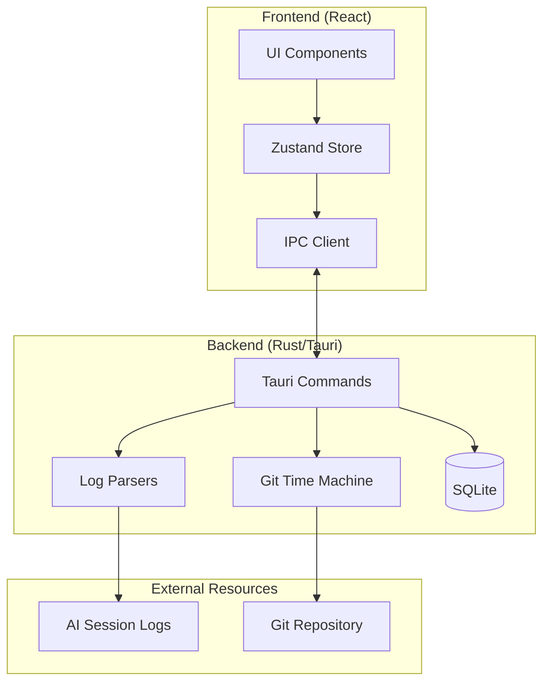

# Mantra Client

**English** | [中文](./README.zh-CN.md)

A local-first time-travel viewer for AI-assisted programming sessions.

## Overview

Mantra Client is a cross-platform desktop application built with Tauri v2, enabling developers to review and analyze the complete process of AI-assisted programming through a "time travel" experience.

**Key Features:**

- **Git Time Anchoring** - Click any AI conversation message to automatically jump to the corresponding Git history state
- **Local First** - Core functionality works completely offline; sensitive data never leaves your machine
- **Non-Invasive** - Operates as a read-only viewer without modifying your Git repository
- **Dual-Stream Playback** - AI conversation stream and code changes precisely aligned on a unified timeline
- **Multi-Tool Support** - Parse sessions from Claude Code, Gemini CLI, Cursor, Codex, Antigravity, Trae
- **i18n Ready** - Full support for English and Simplified Chinese

## Screenshots

<!-- TODO: Add screenshots -->

## Tech Stack

| Layer | Technology |
|-------|------------|
| **Desktop Framework** | Tauri v2 (Rust) |
| **Frontend Framework** | React v19 + TypeScript |
| **Build Tool** | Vite v7 |
| **UI Components** | shadcn/ui + Radix UI |
| **Styling** | Tailwind CSS v4 |
| **State Management** | Zustand |
| **Code Editor** | Monaco Editor |
| **Git Operations** | git2-rs |
| **Local Storage** | SQLite (rusqlite) |

## Project Structure

```
apps/client/
├── src/                        # React frontend
│   ├── components/             # UI components
│   │   ├── common/             # Shared components
│   │   ├── detail/             # Tool detail panel
│   │   ├── editor/             # Code editor components
│   │   ├── filter/             # Message filter components
│   │   ├── git/                # Git status components
│   │   ├── import/             # Import wizard components
│   │   ├── layout/             # Layout components
│   │   ├── narrative/          # Narrative stream (conversation)
│   │   ├── navigation/         # Top bar and navigation
│   │   ├── player/             # Player components
│   │   ├── sanitizer/          # Content sanitization
│   │   ├── search/             # Search components
│   │   ├── settings/           # Settings panel
│   │   ├── sidebar/            # Project drawer
│   │   ├── terminal/           # Terminal output
│   │   ├── timeline/           # TimberLine controller
│   │   └── ui/                 # Base UI (shadcn)
│   ├── contexts/               # React contexts
│   ├── hooks/                  # Custom React hooks
│   ├── i18n/                   # Internationalization
│   │   └── locales/            # en.json, zh-CN.json
│   ├── lib/                    # Utilities and IPC wrappers
│   ├── routes/                 # Page routes
│   ├── stores/                 # Zustand state management
│   └── types/                  # TypeScript type definitions
├── src-tauri/                  # Rust backend
│   └── src/
│       ├── commands/           # Tauri IPC commands
│       ├── git/                # Git time machine
│       ├── models/             # Data models
│       ├── parsers/            # Log parsers
│       │   ├── claude.rs       # Claude Code parser
│       │   ├── cursor/         # Cursor parser
│       │   └── gemini/         # Gemini CLI parser
│       ├── sanitizer/          # Content sanitization engine
│       ├── scanner/            # Project scanner
│       └── storage/            # SQLite persistence
└── public/                     # Static assets
```

## Development

### Prerequisites

- [Node.js](https://nodejs.org/) v20+
- [pnpm](https://pnpm.io/) v9+
- [Rust](https://www.rust-lang.org/) (latest stable)
- Tauri v2 system dependencies (see [Tauri Prerequisites](https://v2.tauri.app/start/prerequisites/))

### Installation

```bash
# From project root
pnpm install
```

### Commands

```bash
# Start dev server (frontend only)
pnpm dev

# Start Tauri dev mode (frontend + Rust)
pnpm tauri dev

# Run tests
pnpm test

# Run tests (single run)
pnpm test:run

# Lint code
pnpm lint

# Build for production
pnpm build

# Build desktop app
pnpm tauri build
```

## Architecture



## Core Modules

### Log Parsers

Parse AI coding assistant session logs in various formats:

| Tool | Format | Status |
|------|--------|--------|
| Claude Code | JSONL | ✅ Supported |
| Gemini CLI | JSONL | ✅ Supported |
| Cursor | SQLite | ✅ Supported |
| Codex | TBD | 📋 Planned |
| Antigravity | TBD | 📋 Planned |
| Trae | TBD | 📋 Planned |

Extracts:
- User messages and AI responses
- Tool calls (file read/write, command execution, etc.)
- Timestamps for timeline synchronization

### Git Time Machine

Read-only Git history queries powered by `git2-rs`:

- Locate nearest commit by timestamp
- Retrieve file content at specific commits
- Compute file diffs

### Project Scanner

Automatic discovery and indexing of local projects:

- Scan directories for Git repositories
- Detect associated AI session logs
- Build project index

## Design System

| Property | Value |
|----------|-------|
| **Theme** | Dark mode (default) |
| **Background** | `#09090b` (Zinc-950) |
| **Surface** | `#18181b` (Zinc-900) |
| **Primary** | `#3b82f6` (Blue-500) |
| **Accent** | `#10b981` (Emerald-500) |

## IDE Setup

Recommended VS Code extensions:

- [Tauri](https://marketplace.visualstudio.com/items?itemName=tauri-apps.tauri-vscode)
- [rust-analyzer](https://marketplace.visualstudio.com/items?itemName=rust-lang.rust-analyzer)
- [Tailwind CSS IntelliSense](https://marketplace.visualstudio.com/items?itemName=bradlc.vscode-tailwindcss)

## Platform Notes

### macOS Installation Guide

Since Mantra is not currently Apple code-signed, macOS will display an "unverified developer" warning on first launch. Use one of the following methods to run:

#### Method 1: Open via Right-Click Menu (Recommended)

1. Locate Mantra.app in **Finder**
2. **Control-click** the app icon (or right-click)
3. Select **"Open"** from the context menu
4. Click **"Open"** again in the confirmation dialog

> The system will remember this preference for future launches.

#### Method 2: Authorize in System Settings

If you've already double-clicked the app and seen the warning:

1. Open **System Settings** → **Privacy & Security**
2. Scroll down to the "Security" section
3. Find the message about Mantra being blocked
4. Click **"Open Anyway"** and enter your password

#### Method 3: Remove Quarantine via Terminal

```bash
xattr -cr /Applications/Mantra.app
```

## Related Documentation

## Contributing

Contributions are welcome! Please read the project's contribution guidelines before submitting PRs.

## License

This project is licensed under the [MIT License](./LICENSE).
