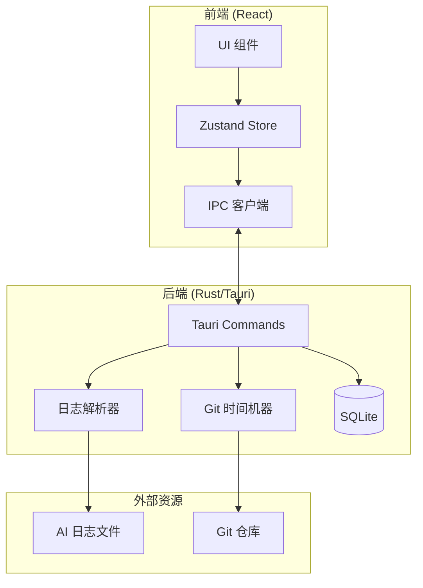

# Mantra Client (心法客户端)

Mantra 桌面客户端 - 本地优先的 AI 编程会话时间旅行查看器。

## 概述

Mantra Client 是一个基于 Tauri v2 构建的跨平台桌面应用，让开发者能够以"时间旅行"的方式回顾和分析 AI 辅助编程的完整过程。

**核心特性：**

- **Git 时间锚定**：点击任意一条 AI 对话，代码视图自动跳转到该时刻的 Git 历史状态
- **本地优先**：核心功能完全离线可用，敏感数据永不离开本地
- **非侵入式**：作为只读 Viewer 存在，不修改用户的 Git 仓库状态
- **双流回放**：AI 对话流与代码变更流在时间轴上精确对齐

## 技术栈

| 层级 | 技术 |
|------|------|
| **桌面框架** | Tauri v2 (Rust) |
| **前端框架** | React v19 + TypeScript |
| **构建工具** | Vite v7 |
| **UI 组件** | shadcn/ui + Radix UI |
| **样式** | Tailwind CSS v4 |
| **状态管理** | Zustand |
| **代码编辑器** | Monaco Editor |
| **Git 操作** | git2-rs |
| **本地存储** | SQLite (rusqlite) |

## 目录结构

```
apps/client/
├── src/                    # React 前端代码
│   ├── components/         # UI 组件
│   │   ├── cards/          # 卡片组件
│   │   ├── editor/         # 代码编辑器组件
│   │   ├── import/         # 导入功能组件
│   │   ├── layout/         # 布局组件
│   │   ├── narrative/      # 叙事流组件 (对话展示)
│   │   ├── search/         # 搜索组件
│   │   ├── timeline/       # 时间轴组件
│   │   └── ui/             # 基础 UI 组件 (shadcn)
│   ├── hooks/              # 自定义 React Hooks
│   ├── lib/                # 工具函数和 IPC 封装
│   ├── routes/             # 路由页面
│   │   ├── Dashboard.tsx   # 仪表盘 (项目列表)
│   │   └── Player.tsx      # 播放器 (会话回放)
│   ├── stores/             # Zustand 状态管理
│   └── types/              # TypeScript 类型定义
├── src-tauri/              # Rust 后端代码
│   ├── src/
│   │   ├── commands/       # Tauri IPC 命令
│   │   ├── git/            # Git 操作模块 (时间旅行)
│   │   ├── models/         # 数据模型
│   │   ├── parsers/        # 日志解析器 (Claude Code)
│   │   ├── scanner/        # 项目扫描器
│   │   └── storage/        # SQLite 数据持久化
│   └── tests/              # Rust 测试
└── public/                 # 静态资源
```

## 开发环境

### 前置要求

- [Node.js](https://nodejs.org/) v20+
- [pnpm](https://pnpm.io/) v9+
- [Rust](https://www.rust-lang.org/) (最新稳定版)
- Tauri v2 系统依赖 (参考 [Tauri Prerequisites](https://v2.tauri.app/start/prerequisites/))

### 安装依赖

```bash
# 在项目根目录执行
pnpm install
```

### 开发命令

```bash
# 启动开发服务器 (仅前端)
pnpm dev

# 启动 Tauri 开发模式 (前端 + Rust)
pnpm tauri dev

# 运行测试
pnpm test

# 运行测试 (单次)
pnpm test:run

# 代码检查
pnpm lint

# 构建生产版本
pnpm build

# 构建桌面应用
pnpm tauri build
```

## 推荐 IDE 配置

- [VS Code](https://code.visualstudio.com/)
- [Tauri](https://marketplace.visualstudio.com/items?itemName=tauri-apps.tauri-vscode) 扩展
- [rust-analyzer](https://marketplace.visualstudio.com/items?itemName=rust-lang.rust-analyzer) 扩展
- [Tailwind CSS IntelliSense](https://marketplace.visualstudio.com/items?itemName=bradlc.vscode-tailwindcss) 扩展

## 架构概览



## 核心功能模块

### 日志解析器

支持解析 Claude Code 的 JSONL 格式会话日志，提取：
- 用户消息和 AI 响应
- 工具调用记录 (文件读写、命令执行等)
- 时间戳信息

### Git 时间机器

基于 `git2-rs` 实现的只读 Git 历史查询：
- 根据时间戳定位最近的 commit
- 获取特定 commit 时刻的文件内容
- 计算文件 diff

### 项目扫描器

自动发现和索引本地项目：
- 扫描指定目录下的 Git 仓库
- 检测关联的 AI 会话日志
- 建立项目索引

## 设计规范

- **主题**：默认深色模式
- **背景色**：`#09090b` (Zinc-950)
- **表面色**：`#18181b` (Zinc-900)
- **主色调**：`#3b82f6` (Blue-500)
- **强调色**：`#10b981` (Emerald-500)

## 相关文档

- [产品需求文档 (PRD)](../../_bmad-output/planning-artifacts/prd.md)
- [系统架构文档](../../_bmad-output/planning-artifacts/architecture.md)
- [UX 设计规范](../../_bmad-output/planning-artifacts/ux-design-specification.md)
