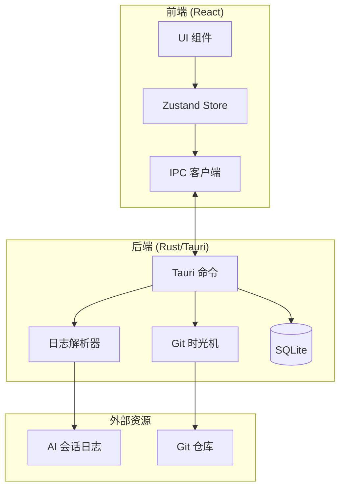

# Mantra Client

[English](./README.md) | **中文**

本地优先的 AI 编程过程时光旅行查看器。

## 概述

Mantra Client 是一个基于 Tauri v2 构建的跨平台桌面应用，帮助开发者通过"时光旅行"体验回顾和分析 AI 辅助编程的完整过程。

**核心特性：**

- **Git 时间锚定** - 点击任意 AI 对话消息，自动跳转到对应的 Git 历史状态
- **本地优先** - 核心功能完全离线可用，敏感数据不会离开本机
- **非侵入式** - 作为只读查看器运行，不会修改 Git 仓库
- **双流回放** - AI 对话流与代码变更在统一时间轴上精准对齐
- **多工具支持** - 支持 Claude Code、Gemini CLI、Cursor、Codex、Antigravity、Trae
- **国际化就绪** - 完整支持英文和简体中文

## 截图

<!-- TODO: 添加截图 -->

## 技术栈

| 层级 | 技术 |
|------|------|
| **桌面框架** | Tauri v2 (Rust) |
| **前端框架** | React v19 + TypeScript |
| **构建工具** | Vite v7 |
| **UI 组件** | shadcn/ui + Radix UI |
| **样式** | Tailwind CSS v4 |
| **状态管理** | Zustand |
| **代码编辑器** | Monaco Editor |
| **Git 操作** | git2-rs |
| **本地存储** | SQLite (rusqlite) |

## 项目结构

```
apps/client/
├── src/                        # React 前端
│   ├── components/             # UI 组件
│   │   ├── common/             # 共享组件
│   │   ├── detail/             # 工具详情面板
│   │   ├── editor/             # 代码编辑器组件
│   │   ├── filter/             # 消息过滤组件
│   │   ├── git/                # Git 状态组件
│   │   ├── import/             # 导入向导组件
│   │   ├── layout/             # 布局组件
│   │   ├── narrative/          # 叙事流（对话）
│   │   ├── navigation/         # 顶栏和导航
│   │   ├── player/             # 播放器组件
│   │   ├── sanitizer/          # 内容脱敏
│   │   ├── search/             # 搜索组件
│   │   ├── settings/           # 设置面板
│   │   ├── sidebar/            # 项目抽屉
│   │   ├── terminal/           # 终端输出
│   │   ├── timeline/           # TimberLine 控制器
│   │   └── ui/                 # 基础 UI (shadcn)
│   ├── contexts/               # React Contexts
│   ├── hooks/                  # 自定义 React Hooks
│   ├── i18n/                   # 国际化
│   │   └── locales/            # en.json, zh-CN.json
│   ├── lib/                    # 工具函数和 IPC 封装
│   ├── routes/                 # 页面路由
│   ├── stores/                 # Zustand 状态管理
│   └── types/                  # TypeScript 类型定义
├── src-tauri/                  # Rust 后端
│   └── src/
│       ├── commands/           # Tauri IPC 命令
│       ├── git/                # Git 时光机
│       ├── models/             # 数据模型
│       ├── parsers/            # 日志解析器
│       │   ├── claude.rs       # Claude Code 解析器
│       │   ├── cursor/         # Cursor 解析器
│       │   └── gemini/         # Gemini CLI 解析器
│       ├── sanitizer/          # 内容脱敏引擎
│       ├── scanner/            # 项目扫描器
│       └── storage/            # SQLite 持久化
└── public/                     # 静态资源
```

## 开发

### 前置要求

- [Node.js](https://nodejs.org/) v20+
- [pnpm](https://pnpm.io/) v9+
- [Rust](https://www.rust-lang.org/) (最新稳定版)
- Tauri v2 系统依赖（参见 [Tauri 前置要求](https://v2.tauri.app/start/prerequisites/)）

### 安装

```bash
# 从项目根目录
pnpm install
```

### 命令

```bash
# 启动开发服务器（仅前端）
pnpm dev

# 启动 Tauri 开发模式（前端 + Rust）
pnpm tauri dev

# 运行测试
pnpm test

# 运行测试（单次）
pnpm test:run

# 代码检查
pnpm lint

# 生产构建
pnpm build

# 构建桌面应用
pnpm tauri build
```

## 架构



## 核心模块

### 日志解析器

解析各种格式的 AI 编程助手会话日志：

| 工具 | 格式 | 状态 |
|------|------|------|
| Claude Code | JSONL | ✅ 支持 |
| Gemini CLI | JSONL | ✅ 支持 |
| Cursor | SQLite | ✅ 支持 |
| Codex | TBD | 📋 计划中 |
| Antigravity | TBD | 📋 计划中 |
| Trae | TBD | 📋 计划中 |

提取内容：
- 用户消息和 AI 响应
- 工具调用（文件读写、命令执行等）
- 时间戳（用于时间轴同步）

### Git 时光机

基于 `git2-rs` 的只读 Git 历史查询：

- 根据时间戳定位最近的提交
- 获取指定提交时的文件内容
- 计算文件差异

### 项目扫描器

自动发现和索引本地项目：

- 扫描目录中的 Git 仓库
- 检测关联的 AI 会话日志
- 构建项目索引

## 设计系统

| 属性 | 值 |
|------|---|
| **主题** | 深色模式（默认） |
| **背景** | `#09090b` (Zinc-950) |
| **表面** | `#18181b` (Zinc-900) |
| **主色** | `#3b82f6` (Blue-500) |
| **强调色** | `#10b981` (Emerald-500) |

## IDE 设置

推荐的 VS Code 扩展：

- [Tauri](https://marketplace.visualstudio.com/items?itemName=tauri-apps.tauri-vscode)
- [rust-analyzer](https://marketplace.visualstudio.com/items?itemName=rust-lang.rust-analyzer)
- [Tailwind CSS IntelliSense](https://marketplace.visualstudio.com/items?itemName=bradlc.vscode-tailwindcss)

## 平台说明

### macOS 安装指南

由于 Mantra 目前未进行 Apple 代码签名，首次打开时 macOS 会显示"无法验证开发者"警告。请使用以下方法之一运行：

#### 方法一：右键菜单打开（推荐）

1. 在 **访达 (Finder)** 中找到 Mantra.app
2. 按住 **Control** 键点击应用图标（或右键点击）
3. 在弹出菜单中选择 **"打开"**
4. 在确认对话框中再次点击 **"打开"**

> 系统会记住此偏好，之后可直接双击运行。

#### 方法二：系统设置授权

如果已双击过应用并看到警告：

1. 打开 **系统设置** → **隐私与安全性**
2. 向下滚动到"安全性"部分
3. 找到关于 Mantra 被阻止的提示
4. 点击 **"仍要打开"** 并输入密码确认

#### 方法三：命令行移除隔离属性

```bash
xattr -cr /Applications/Mantra.app
```

## MCP Gateway

Mantra Client 内置 MCP Gateway，允许 AI 编程助手（如 Claude Code、Cursor）通过 MCP 协议连接并使用 MCP 服务。

### 功能特性

- **MCP Streamable HTTP 协议 (2025-03-26)** - 完整支持最新 MCP 规范
- **统一 `/mcp` 端点** - 支持 POST (JSON-RPC)、GET (SSE)、DELETE 操作
- **Origin 验证** - 防止 DNS rebinding 攻击
- **会话管理** - MCP-Session-Id Header 自动管理
- **向后兼容** - 同时支持旧版 `/sse` + `/message` 端点

### 使用方法

1. 在 **Hub** 页面启用 Gateway
2. 添加并启用 MCP 服务
3. 点击 **Copy Config** 按钮复制配置
4. 将配置粘贴到 Claude Code 或 Cursor 的配置文件

#### Claude Code 配置

在 `~/.claude.json` 中添加：

```json
{
  "mcpServers": {
    "mantra-gateway": {
      "url": "http://127.0.0.1:<port>/mcp",
      "headers": {
        "Authorization": "Bearer <token>"
      }
    }
  }
}
```

#### Cursor 配置

在 `.cursor/mcp.json` 中添加：

```json
{
  "mcpServers": {
    "mantra-gateway": {
      "url": "http://127.0.0.1:<port>/mcp",
      "headers": {
        "Authorization": "Bearer <token>"
      }
    }
  }
}
```

### 端点说明

| 端点 | 方法 | 说明 |
|------|------|------|
| `/mcp` | POST | JSON-RPC 请求/通知 |
| `/mcp` | GET | SSE 流（服务端推送） |
| `/mcp` | DELETE | 终止会话 |
| `/health` | GET | 健康检查 |
| `/sse` | GET | (已弃用) 旧版 SSE 端点 |
| `/message` | POST | (已弃用) 旧版消息端点 |

## 相关文档

- [跨仓库发布配置指南](./docs/cross-repo-release-setup.zh-CN.md)

## 贡献

欢迎贡献！请在提交 PR 前阅读项目的贡献指南。

## 许可证

本项目采用 [MIT 许可证](./LICENSE)。

---

<p align="center">
  Made with ❤️ by <a href="https://gonewx.com">NewX Team</a>
</p>
