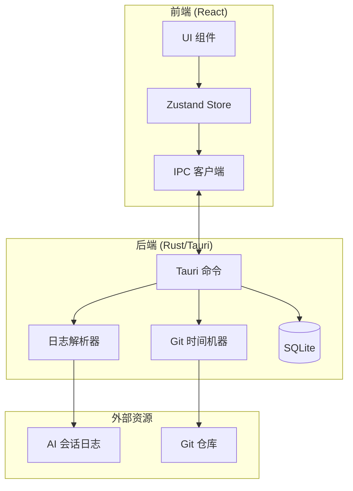

# Mantra Client (心法客户端)

本地优先的 AI 编程会话时间旅行查看器。

## 概述

Mantra Client 是一个基于 Tauri v2 构建的跨平台桌面应用，让开发者能够以"时间旅行"的方式回顾和分析 AI 辅助编程的完整过程。

**核心特性：**

- **Git 时间锚定** - 点击任意一条 AI 对话，代码视图自动跳转到该时刻的 Git 历史状态
- **本地优先** - 核心功能完全离线可用，敏感数据永不离开本地
- **非侵入式** - 作为只读查看器存在，不修改用户的 Git 仓库状态
- **双流回放** - AI 对话流与代码变更流在时间轴上精确对齐
- **多工具支持** - 支持解析 Claude Code、Gemini CLI、Cursor、Codex、Antigravity、Trae
- **国际化支持** - 完整支持中英文界面

## 截图

<!-- TODO: 添加截图 -->

## 技术栈

| 层级 | 技术 |
|------|------|
| **桌面框架** | Tauri v2 (Rust) |
| **前端框架** | React v19 + TypeScript |
| **构建工具** | Vite v7 |
| **UI 组件** | shadcn/ui + Radix UI |
| **样式** | Tailwind CSS v4 |
| **状态管理** | Zustand |
| **代码编辑器** | Monaco Editor |
| **Git 操作** | git2-rs |
| **本地存储** | SQLite (rusqlite) |

## 目录结构

```
apps/client/
├── src/                        # React 前端代码
│   ├── components/             # UI 组件
│   │   ├── common/             # 通用组件
│   │   ├── detail/             # 工具详情面板
│   │   ├── editor/             # 代码编辑器组件
│   │   ├── filter/             # 消息过滤组件
│   │   ├── git/                # Git 状态组件
│   │   ├── import/             # 导入向导组件
│   │   ├── layout/             # 布局组件
│   │   ├── narrative/          # 叙事流组件（对话展示）
│   │   ├── navigation/         # 顶栏与导航
│   │   ├── player/             # 播放器组件
│   │   ├── sanitizer/          # 内容脱敏组件
│   │   ├── search/             # 搜索组件
│   │   ├── settings/           # 设置面板
│   │   ├── sidebar/            # 项目抽屉
│   │   ├── terminal/           # 终端输出
│   │   ├── timeline/           # 时间轴控制器
│   │   └── ui/                 # 基础 UI（shadcn）
│   ├── contexts/               # React Context
│   ├── hooks/                  # 自定义 React Hooks
│   ├── i18n/                   # 国际化
│   │   └── locales/            # en.json, zh-CN.json
│   ├── lib/                    # 工具函数和 IPC 封装
│   ├── routes/                 # 路由页面
│   ├── stores/                 # Zustand 状态管理
│   └── types/                  # TypeScript 类型定义
├── src-tauri/                  # Rust 后端代码
│   └── src/
│       ├── commands/           # Tauri IPC 命令
│       ├── git/                # Git 时间机器
│       ├── models/             # 数据模型
│       ├── parsers/            # 日志解析器
│       │   ├── claude.rs       # Claude Code 解析器
│       │   ├── cursor/         # Cursor 解析器
│       │   └── gemini/         # Gemini CLI 解析器
│       ├── sanitizer/          # 内容脱敏引擎
│       ├── scanner/            # 项目扫描器
│       └── storage/            # SQLite 数据持久化
└── public/                     # 静态资源
```

## 开发环境

### 前置要求

- [Node.js](https://nodejs.org/) v20+
- [pnpm](https://pnpm.io/) v9+
- [Rust](https://www.rust-lang.org/)（最新稳定版）
- Tauri v2 系统依赖（参考 [Tauri Prerequisites](https://v2.tauri.app/start/prerequisites/)）

### 安装依赖

```bash
# 在项目根目录执行
pnpm install
```

### 开发命令

```bash
# 启动开发服务器（仅前端）
pnpm dev

# 启动 Tauri 开发模式（前端 + Rust）
pnpm tauri dev

# 运行测试
pnpm test

# 运行测试（单次）
pnpm test:run

# 代码检查
pnpm lint

# 构建生产版本
pnpm build

# 构建桌面应用
pnpm tauri build
```

## 架构概览



## 核心功能模块

### 日志解析器

支持解析多种 AI 编程助手的会话日志：

| 工具 | 格式 | 状态 |
|------|------|------|
| Claude Code | JSONL | ✅ 已支持 |
| Gemini CLI | JSONL | ✅ 已支持 |
| Cursor | SQLite | ✅ 已支持 |
| Codex | 待定 | 📋 计划中 |
| Antigravity | 待定 | 📋 计划中 |
| Trae | 待定 | 📋 计划中 |

提取内容：
- 用户消息和 AI 响应
- 工具调用记录（文件读写、命令执行等）
- 时间戳信息（用于时间轴同步）

### Git 时间机器

基于 `git2-rs` 实现的只读 Git 历史查询：

- 根据时间戳定位最近的 commit
- 获取特定 commit 时刻的文件内容
- 计算文件 diff

### 项目扫描器

自动发现和索引本地项目：

- 扫描指定目录下的 Git 仓库
- 检测关联的 AI 会话日志
- 建立项目索引

## 设计规范

| 属性 | 值 |
|------|-----|
| **主题** | 深色模式（默认） |
| **背景色** | `#09090b` (Zinc-950) |
| **表面色** | `#18181b` (Zinc-900) |
| **主色调** | `#3b82f6` (Blue-500) |
| **强调色** | `#10b981` (Emerald-500) |

## 推荐 IDE 配置

推荐的 VS Code 扩展：

- [Tauri](https://marketplace.visualstudio.com/items?itemName=tauri-apps.tauri-vscode)
- [rust-analyzer](https://marketplace.visualstudio.com/items?itemName=rust-lang.rust-analyzer)
- [Tailwind CSS IntelliSense](https://marketplace.visualstudio.com/items?itemName=bradlc.vscode-tailwindcss)

## 平台说明

### macOS 图标生成

`.icns` 文件需要在 macOS 上使用 `iconutil` 命令生成。如需发布 macOS 版本，请在 Mac 上运行：

```bash
cd apps/client/src-tauri/icons
iconutil -c icns icon.iconset
```

## 相关文档

## 贡献

欢迎贡献代码！提交 PR 前请阅读项目的贡献指南。

## 许可证

本项目采用 [MIT 许可证](./LICENSE) 开源。
